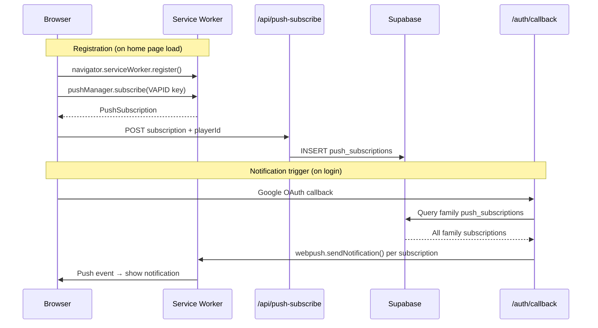
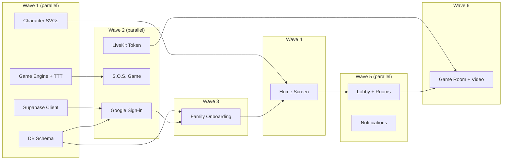
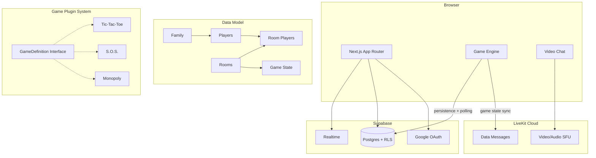

# Project Journal — FamJam

> Maintained by Claude Code sessions. Each entry captures what was done, why, and what's next.

## Project Overview

FamJam is a web-based family game platform where 2-4 players play simple turn-based games (starting with Tic-Tac-Toe and S.O.S.) while video chatting in real time via LiveKit. Built with Next.js 15, Supabase (auth, database, realtime), and LiveKit Cloud. Designed for a family with young children (ages 6 and 8.5, Greek native speakers learning English). Features a family account model where parents sign in with Google and kids just tap their avatar.

## Retrospective (auto-generated catch-up)

> This section was generated from git history to bootstrap the journal.

**Commits to date:**
- `bd98a43` Initial commit from Create Next App
- `23a3069` chore: scaffold Next.js project with Supabase, LiveKit, and Vitest

The project has just been initialized with the Next.js 15 App Router, TypeScript, Tailwind CSS, and ESLint. Core dependencies for Supabase client libraries (`@supabase/supabase-js`, `@supabase/ssr`) and LiveKit (`@livekit/components-react`, `livekit-client`) have been installed. Vitest was configured for testing with React Testing Library support.

The repository is clean with no uncommitted changes. No design documents exist in the project folder yet, but planning docs are maintained separately at `/Users/me/dev/docs/plans/`:
- `2026-02-14-gamechat-design.md` — Full architecture and data model
- `2026-02-14-gamechat-implementation-plan.md` — 14-task implementation roadmap

**Current state:** Project scaffold complete. Ready to begin Task 2.

---

## Journal Entries

<!-- New entries go above this line, newest first -->

### 2026-02-18 — Monopoly Game + Selectable Themes (v0.1.1)

**Branch:** main

**What was done:**
- Built full Junior Monopoly game engine (`src/lib/games/monopoly.ts`) — 24-space board, 4 property groups, buying, upgrades, rent, magic cards, troll/lucky/rest spaces, pass-GO bonus, first-to-30-coins win condition
- 32 unit tests covering movement, buying, rent, upgrades, special spaces, winning, turn rotation, and edge cases
- Created board UI component (`src/components/games/monopoly-board.tsx`) — 7x7 perimeter grid, animated dice roll, buy/upgrade prompts, player tokens with avatars, event toasts
- Registered Monopoly in the game registry
- **Selectable board themes:** separated mechanical board data (prices, rent, layout) from visual layer (names, emojis, colors)
  - `src/lib/games/monopoly-themes.ts` — theme definitions with per-group colors and per-space names/emojis
  - **Park theme** (default): Bunny, Duckling, Puppy, Kitten groups — cute animals in the park
  - **Magic theme**: Potion, Spell, Wand, Crystal groups — school of magic
  - Toggle UI: pill-style segmented control above the scoreboard
  - Theme is client-side only (visual preference, not game state)
- Various app improvements: leave-room API, room player cleanup migrations, video chat fixes, layout updates

**Architecture:**
```
BOARD (monopoly.ts)          — mechanical: index, type, group1-4, price, rent
  ↓ merged at render time
THEMES (monopoly-themes.ts)  — visual: names, emojis, group colors, center label
  ↓
MonopolyBoard (monopoly-board.tsx) — getThemedSpace() overlays theme on BOARD data
```

**Quality:** 55/55 tests passing (32 monopoly + 13 SOS + 10 TTT), `next build` clean.

**What's next:**
- Add more themes (easy — just add entries to THEMES object)
- Monopoly magic card text could also be themed per theme
- End-to-end testing on real devices

---

### 2026-02-17 — Web Push Notifications

**Branch:** main

**What was done:**
- Added web push notifications to alert parents when kids log in
- Created service worker (`public/sw.js`) to handle push events
- Built push subscription API endpoint (`/api/push-subscribe`) to store browser subscriptions
- Added `push_subscriptions` table with RLS policies (migration 008)
- Integrated push registration into home page (asks for notification permission, registers service worker)
- Modified auth callback to send push notifications to all family members when someone logs in
- Installed `web-push` and `@types/web-push` dependencies



**Why:**
- Parents need to know when their kids open the app, especially since kids don't have their own accounts
- Web Push API provides native browser notifications that work across platforms
- Service worker enables background push event handling even when the app isn't open

**What's next:**
- Test push notifications on real devices (especially iPad Mini 2 and parent devices)
- Consider additional notification triggers (game invites, turn notifications)
- Complete remaining features from implementation plan

---

### 2026-02-15 — Bug Fixes and Family Invites

**Branch:** main

**What was done:**
- Added email-based family invites: `family_invites` table, `accept_pending_invites` RPC, auto-join on auth callback
- Added tabbed UI in add-member dialog for existing family members vs. email invites
- Fixed tic-tac-toe move flash/disappear bug (polling race condition with optimistic updates)
- Fixed tic-tac-toe CSS (stable cell sizes, internal grid lines)
- Fixed audio not playing (AudioTrack only rendered in lite mode)
- Fixed mute mic button (switched from LiveKitRoom prop to useLocalParticipant imperative API)
- Added presence chips showing connected/disconnected players using LiveKit participants
- Added back button to lobby
- Added player names/avatars to lobby room cards

**Why:**
- Discovered Supabase Realtime broadcast not working (server acks but doesn't relay messages) — switched game sync to LiveKit data messages for reliability
- Optimistic updates in tic-tac-toe were conflicting with polling interval, causing moves to flash and disappear
- Video chat component was only rendering AudioTrack in lite mode, breaking audio in standard mode
- Mute control needed direct participant API access instead of declarative props

**What's next:**
- Investigate Supabase Realtime broadcast issue (migration 007 added RLS policies but didn't fix it)
- Consider removing Supabase Realtime dependency entirely if LiveKit data messages prove sufficient
- End-to-end testing with real devices (iPad Mini 2)

### 2026-02-15 — Feature Complete (12/13 tasks done)

**What was done:**
- Completed all 12 implementation tasks using parallel agent dispatching (beads for tracking)
- Wave 1 (4 parallel): Supabase client, DB schema, game engine + TTT, character SVGs
- Wave 2 (3 parallel): Google sign-in, S.O.S. game, LiveKit token endpoint
- Wave 3 (1): Family onboarding
- Wave 4 (1): Family home screen (player select)
- Wave 5 (2 parallel): Lobby + room creation, parent notifications
- Wave 6 (1): Game room with video chat + game boards



**Key files by feature:**
- **Auth:** `src/lib/supabase/{client,server,middleware}.ts`, `src/middleware.ts`, `src/app/auth/callback/route.ts`, `src/app/login/page.tsx`
- **Database:** `supabase/migrations/001_initial_schema.sql` (7 tables, RLS, seed data)
- **Family:** `src/app/actions/family.ts`, `src/app/onboarding/page.tsx`, `src/app/home/page.tsx`, `src/lib/hooks/use-family.ts`
- **Games:** `src/lib/games/{types,tic-tac-toe,sos,registry}.ts` (23 tests)
- **Lobby:** `src/app/lobby/page.tsx`, `src/app/actions/rooms.ts`, `src/lib/hooks/use-active-player.ts`
- **Game room:** `src/app/room/[roomId]/page.tsx`, `src/components/video-chat.tsx`, `src/components/games/{tic-tac-toe-board,sos-board}.tsx`, `src/lib/hooks/use-game-room.ts`
- **Notifications:** `src/lib/notifications.ts`
- **Assets:** `public/characters/*.svg` (8 animals)

**Quality gates:** 23/23 tests passing, `next build` clean, all TypeScript checks pass.

**Issues encountered:**
- `@livekit/components-styles` is a separate package (not bundled with `@livekit/components-react`) — agent self-fixed
- `@supabase/ssr` not pre-installed — agent self-fixed
- Next.js 16 middleware deprecation warning (functional, cosmetic only)

**What's next:**
- **famjam-xay:** Manual end-to-end smoke test — requires Supabase project + Google OAuth + LiveKit Cloud credentials in `.env.local`, then run `npm run dev` and test the full flow
- Future: AI game host, more games, deployment

---

### 2026-02-15 — Project Kickoff

**What was done:**
- Designed the full architecture (Next.js + Supabase + LiveKit)
- Created design doc at `/Users/me/dev/docs/plans/2026-02-14-gamechat-design.md`
- Created implementation plan at `/Users/me/dev/docs/plans/2026-02-14-gamechat-implementation-plan.md`
- Scaffolded Next.js 15 project with TypeScript, Tailwind, Supabase client, LiveKit, and Vitest
- 14 tasks planned across 7 phases



**Key decisions:**
- **Family account model** (parents sign in with Google, kids just pick avatars) — Under-8 kids can't manage logins
- **Supabase over Firebase** — Relational data model (families → players → rooms) fits better than document structure
- **Adaptive video mode** — Spotlight mode for old iPad Mini 2 (only show active player's video, keep all audio) via manual LiveKit track subscription
- **Game engine as pluggable interface** — Adding new games is plug-and-play: implement the `GameDefinition` interface and register it

**Tech stack rationale:**
- **Next.js 15 (App Router):** Fast iteration, SSR for lobby, large ecosystem
- **LiveKit Cloud:** Open-source, Safari 11+ support (critical for iOS devices), manual track subscription for low-end hardware
- **Supabase:** Built-in Google OAuth, Postgres + Realtime for turn-based sync, RLS for family data isolation
- **Vitest:** Fast unit tests for game logic (TDD approach for Tic-Tac-Toe and S.O.S.)

**What's next:**
- **Task 2:** Supabase client setup and auth middleware
- **Task 3:** Database schema with RLS policies
- **Tasks 4-6:** Auth flow (Google sign-in), onboarding, player selection screen
- **Tasks 7-8:** Game logic (Tic-Tac-Toe and S.O.S.) with TDD
- **Tasks 9-11:** Lobby, LiveKit token endpoint, game room with video chat
- **Tasks 12-14:** Parent notifications, character SVG assets, end-to-end testing

**Game backlog (future):** Memory Match, Picture Quiz, Hangman, Math Battle, Word Scramble, Connect Four, UNO-like, Pictionary, Monopoly-lite
